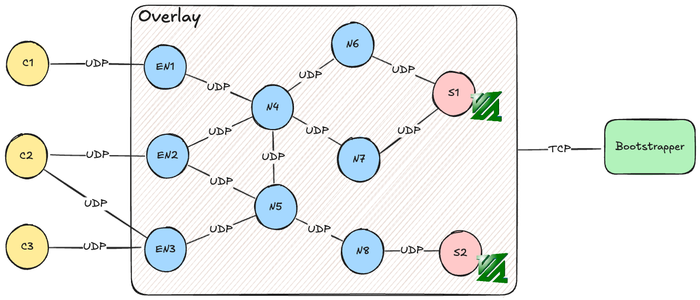

# Pessi Streamer

As a sequel of [Pessi Torrent](https://github.com/ruilopesm/pessi-torrent-cc), **Pessi Streamer** is a distributed
system designed for real-time video streaming over an overlay network.
It enables clients to watch videos from streaming servers through a network of nodes.




## How it works

The system consists of three main components:

1. **Server**: The server is responsible for encoding the video using FFmpeg and streaming it to the neighboring nodes.
2. **Node**: The node acts as a relay between the server and the clients. It receives video data from the server (or
   other nodes) and forwards it to nodes that are interested in delivering the video.
3. **Client**: The client is the end-user application that receives the video stream from the nodes and displays it to
   the user.

There is also a **Bootstrapper** component, a simple server to tell which neighbors each server/node has. When a
server/node connects to it, sends a list of its neighbors and immediately disconnects.

### Step by step breakdown

1. **Bootstrapper Initialization**
    - The bootstrapper initializes with a [TOML configuration](topologies/neighbours.toml) that specifies the network
      topology.
    - The bootstrapper launches with a [defining the network topology](topologies/neighbours.toml), mapping each
      server/node IP to its neighbors.
    - It then listens for incoming TCP connections from nodes and servers.

2. **Node and Server Setup**:
    - Nodes and the server contact the bootstrapper to obtain their neighbor lists.
    - The server starts encoding video files in real time using FFmpeg, converting them into MPEG-TS format with H.264
      video and AAC audio codecs. At this stage, video streams are not yet distributed.

3. **Distribution Tree Formation**:
    - Periodic flood packets from the server update the topology and video availability across the network.

4. **Client Connection**:
    - Clients connect to specific nodes designated as points of presence (PoPs), querying them for a list of available
      videos and choosing streams to watch.
    - The client GUI, built with Egui, displays video options and node status based on round-trip time (RTT).

5. **Streaming Process**:
    - Clients send stream requests to nodes. If a node is not already receiving the requested stream, it forwards the
      request toward the server through the nodes in the distribution tree.
    - Nodes maintain subscription lists, delivering streams only to interested clients.
    - Video packets travel via unreliable UDP for low latency, while control packets use a reliable mechanism with
      retransmission until acknowledged.
    - If a node fails, the system dynamically reroutes streams or reconnects to alternate nodes, ensuring
      uninterrupted playback.

## Code Components

- **Bootstrapper
  ** ([bootstrapper/src/bootstrapper.rs](bootstrapper/src/bootstrapper.rs), [topologies/neighbours.toml](topologies/neighbours.toml)):
    - Initializes the network topology by distributing neighbor lists and IDs via TCP.

- **Node** ([node/src/handle.rs](node/src/handle.rs)):
    - Forms the backbone of the distribution network, routing video packets and managing client subscriptions.

- **Server** ([server/src/server.rs](server/src/server.rs), [server/src/video.rs](server/src/video.rs)):
    - Encodes and stream video content, broadcasting packets to subscribed nodes and sending periodic flood
      packets for network monitoring.

- **Client** ([client/src/client.rs](client/src/client.rs), [client/src/ui.rs](client/src/ui.rs)):
    - Provides a GUI for users to connect to nodes, select videos, and watch streams in real-time using
      players like MPV or FFplay (the client can choose the player via flags).

- **Common** ([common/src/packet.rs](common/src/packet.rs), [common/src/reliable.rs](common/src/reliable.rs)):
    - Contains shared utilities, including packet definitions and a "reliable UDP" implementation.

## Technology Stack

- **Rust**
- **Tokio** for async support.
- **Serde & Bincode** for serialization and protocol.
- **Egui & Eframe** for the client GUI.
- **FFmpeg** for the video encoding on the server.

## Running

### Pre-requisites

- Install [Rust](https://www.rust-lang.org/tools/install).
- Install [MPV](https://mpv.io/) or [FFplay (via FFmpeg)](https://ffmpeg.org/ffplay.html) for the client.
- The server should automatically install FFmpeg if it couldn't be found.

### Setup

1. Clone the repository.
2. Create the topology in `topologies/neighbours.toml` to define the network structure.
    - Ensure the machine can bind to the specified IPs.
3. Run the bootstrapper:
    ```bash
    cargo run -p bootstrapper --release -- --bind_ip <BOOTSTRAPPER_IP>
    ```
4. Define a `BOOTSTRAPPER_IP` environment variable to the `<BOOTSTRAPPER_IP>` you used in the previous step.
5. Run the server:
    ```bash
    cargo run -p server --release -- --ip <SERVER_IP> --videos <VIDEOS_FOLDER>
    ```
    - This `<SERVER_IP>` should be one in the `topologies/neighbours.toml` file.
    - The `<VIDEOS_FOLDER>` should contain the videos you want to stream; the server monitors this folder and supports
      adding videos during runtime.
6. Run the nodes:
    ```bash
    cargo run -p node --release -- --ip <NODE_IP>
    ```
    - This `<NODE_IP>` should also be one in the `topologies/neighbours.toml` file.
7. When the nodes are up, run the client:
    ```bash
    cargo run -p client --release -- --servers <SERVERS>
    ```
    - Provide `<SERVERS>` as a comma-separated list of node IPs to connect to.
8. In the client interface, choose a video; it requests the stream via a node, which fetches it from the
   server if needed.
9. Once video packets arrive, an MPV or FFplay window opens to play the selected video.

## What could be improved

- Connections lack encryption, leaving data exposed, and the system relies heavily on trusting IPs in the UDP packet
  header, which can be easily spoofed.
- The Rust code could also be improved; it includes unnecessary cloning in some areas, which could be optimized.
  Nevertheless, the main bottleneck should be the video decoding/encoding capabilities of the server.

## Notes

This project was created for educational purposes as part of a school assignment in the "Engenharia de Serviços em Rede"
course. For further details, although in Portuguese, refer to the project report
in [report/report.pdf](report/report.pdf).